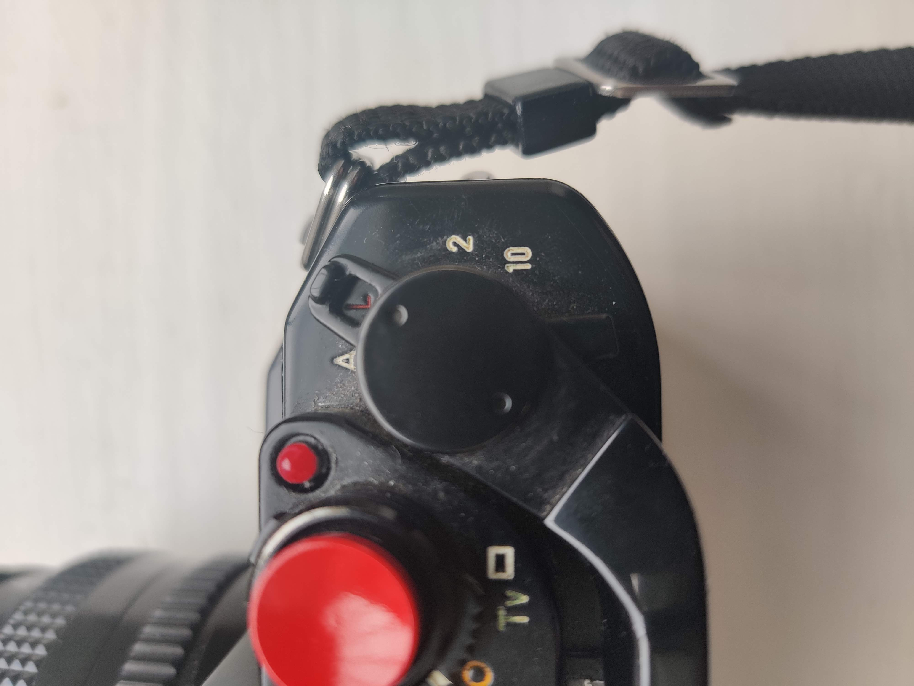
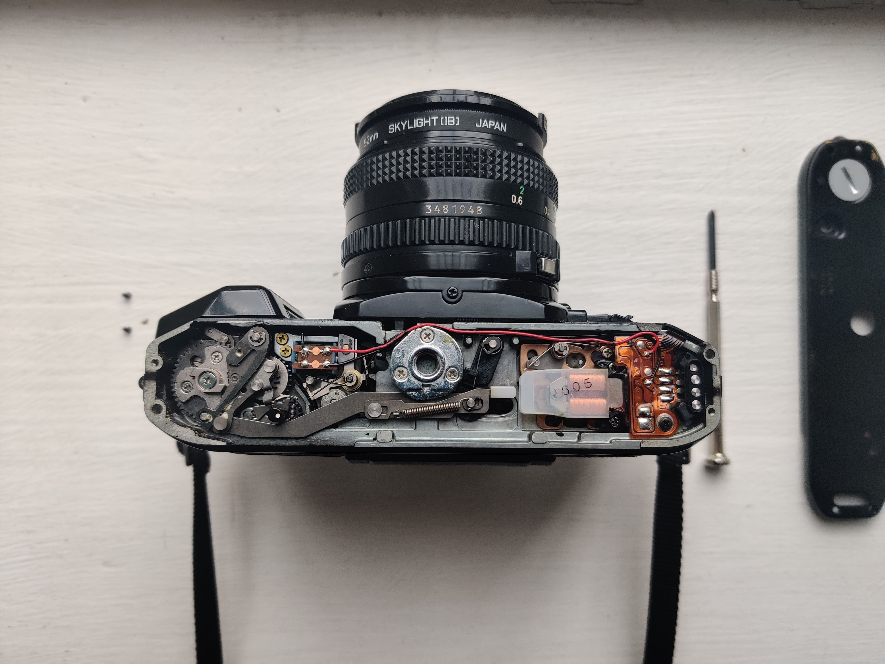
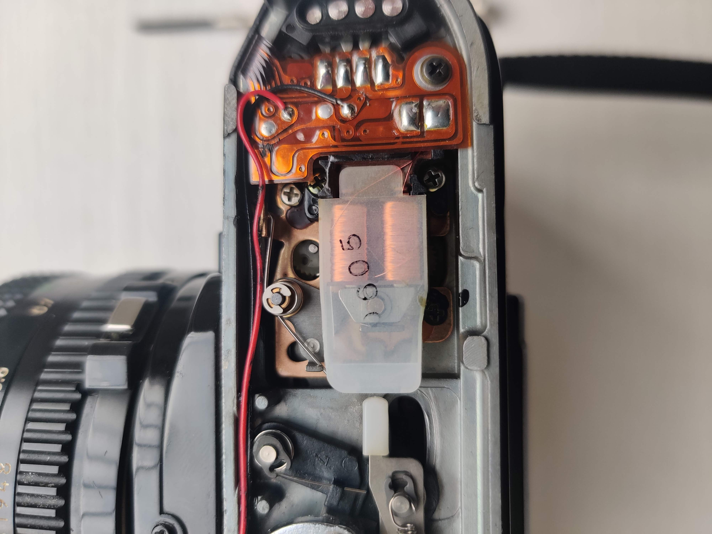

## The Problem

Recently while I out on yet another walk around the local area with my camera, I ran into a peculiar error using my old trusty Canon A-1. When I brought the viewfinder up to my eye and pressed the shutter button to snap the photo, instead of the usual _snap_ one would normally hear, I heard nothing and my viewfinder was filled with doomsday red digital E symbols. I immediately tested the battery and tried re-cocking the film advance lever to no avail. Upon taking the camera home I figured out the simple fix which I will share with you below.

## The Fix

First of all, make sure to switch the camera off by switching it to `L`:

Next remove the bottom base plate by removing the two screws on either side. Be careful not to lose these as they are fairly tiny.

See the silver tapezoid beside those two copper coloured coils underneath the transluscent plastic covering? When you normally take a photo and advance the film lever, they should finish apart from one another. Using the screw driver you can gently push the thin pointy silver thingy upwards and they should come apart without much effort.
Now you won't see the dreaded red 'EEEEE' error when you look through the viewfinder and the shutter release button shall work as expected.

