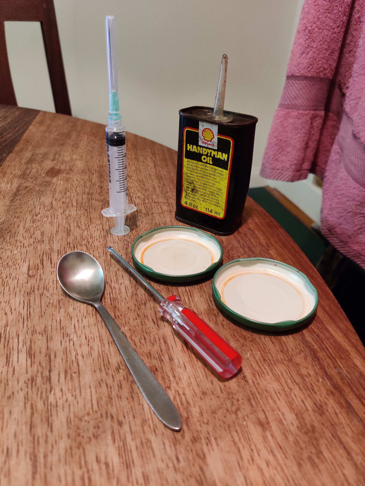
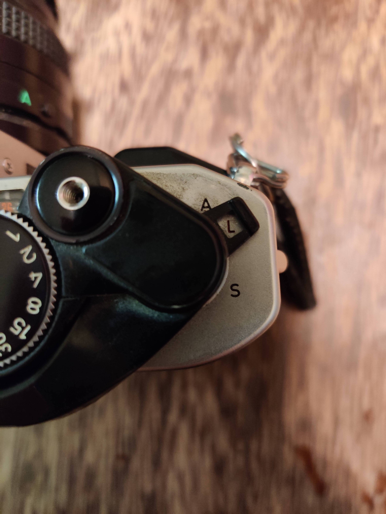
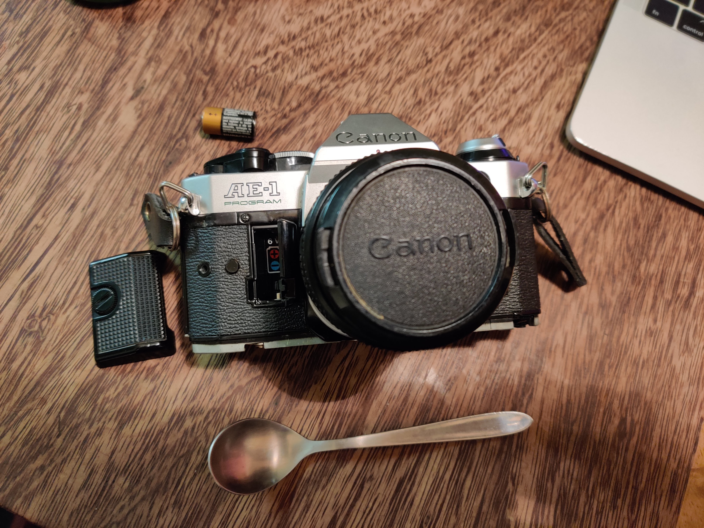
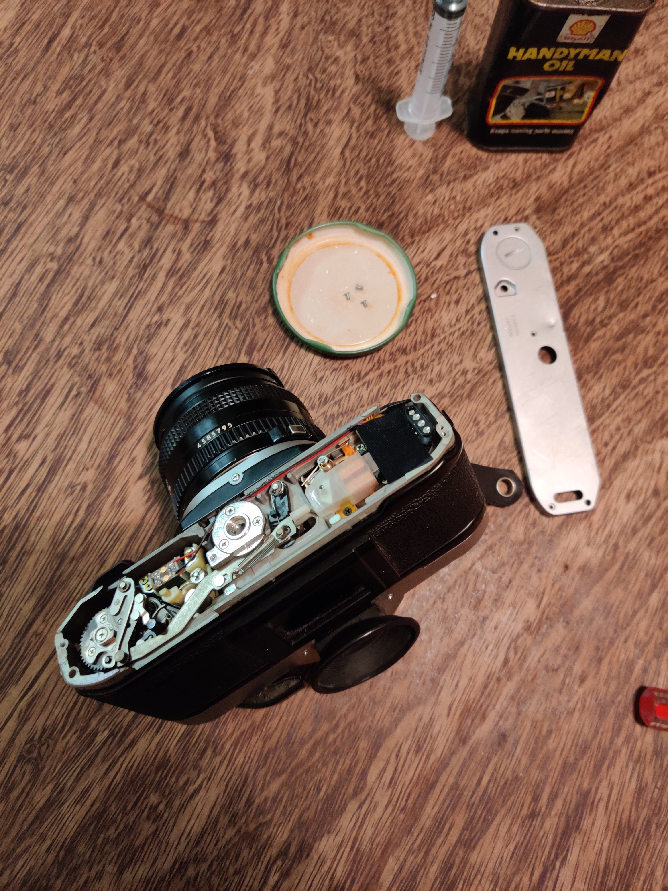
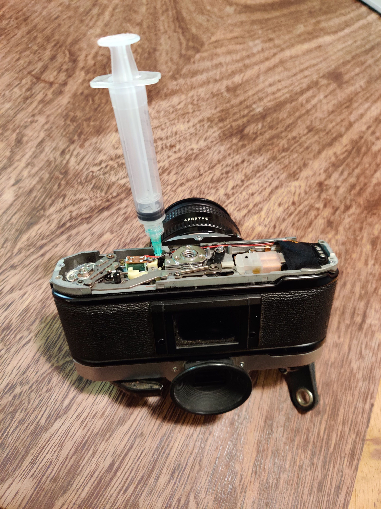

## Intro

The strange squeaky, wheezy sound coming from that secondhand 35mm SLR you just picked up from Adverts/Craiglist/local flea market? It shouldn't do that!

In this guide I'll quickly run you through the steps of fixing said issue. The whole process should take about 15-20 minutes of your time provided you have all of the necessary equipment on hand.
I've carried out this procedure 3 times on friend's cameras as well as my own Canon A-1. It's worked [every time!](https://youtu.be/IKiSPUc2Jck?t=58)

Here's the [before](https://photos.app.goo.gl/jWwHhvdGUw7SqvP56) and [after](https://photos.app.goo.gl/8NhLrgqcQGtQDFrP7) so you can hear the difference in sound.

_Disclaimer: If you want to be absolutely safe and sure your camera is fixed properly then it get it serviced by a professional and not on the advice of a cowboy with screwdriver and syringe._

## What you'll need

Starting off, here's the list of things you'll need:

- Oil (I use some Shell Handyman Oil that I found in my shed. Alternaitevly you could buy some clock oil from [Amazon](https://www.amazon.co.uk/Precision-Oiler-Clocks-Watches-Instruments/dp/B01DRA4LP4/ref=sr_1_5?keywords=clock+oil&qid=1583265750&sr=8-5))
- Medical syringe to inject the oil (If you buy the clock oil linked above, you won't need this!)
- Screwdriver to remove the backplate screws
- Spoon/coin to remove the battery door cover

(I did warn you it was ghetto...)

## Procedure

- Cock the shutter to reveal the hole the oil containing syringe will go into.

- Turn off the camera by flicking the switch on the top to 'L'.

- Use a spoon or coing to loosen the battery door cover on left-hand-side of the camera as it faces you.

- Open the door and take out the battery.

- Turn the camera upside down and remove the 3 screws holding in the bottom plate. (Be careful not to lose these, I placed mine in a spare jar lid for safe keeping!)

- With the backplate removed, put some oil into your needle and place it into the hole as shown below.
- Push the needle plunger down (or tap the bottom if you're using the clock oil from Amazon) to inject a few drops of oil.

- Repeat the step above 2 or 3 times and leave the camera upsidedown for 10-15 minutes to let the oil work its way through.
- Put the camera back together and test the shutter. If it's still squeaky, add a few more drops of oil and wait again.
  You'll know it's good to go when the [_squeak_](https://photos.app.goo.gl/jWwHhvdGUw7SqvP56) becomes a satisfying [_click_](https://photos.app.goo.gl/8NhLrgqcQGtQDFrP7).

Hope that helps! Happy snapping!
