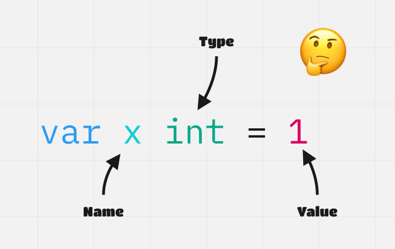
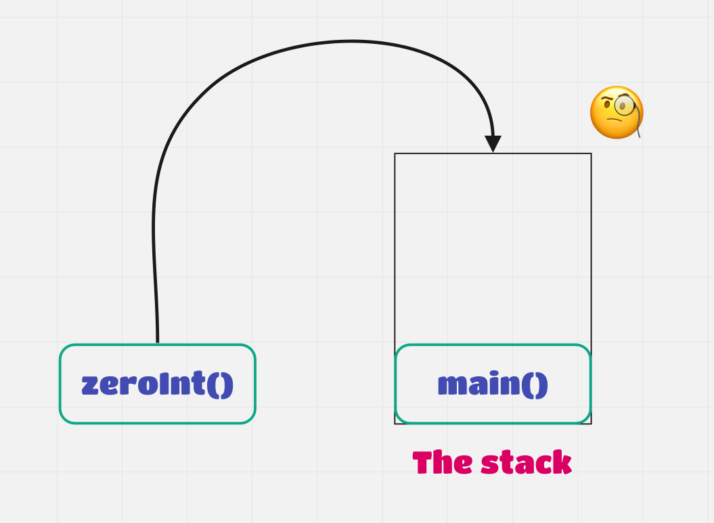

## Intro
In this post I’ll try to explain pointers in Go in as simple terms as possible starting from the absolute basics.
The ultimate goal for this post is for anyone with any amount of programming experience to understand how pointers in Go work.

Let’s start with variables. So what exactly is a variable and what does it consist of?

Take the following example:



The symbol `x` here is our variable of type int (short for integer), and it has been assigned a value of `1`.

From this basic example we can see that a variable can be broken down to three different things:
- Name
- Type
- Value

However, there is a fourth - the address of the value in memory. In our example above this may look something like `0xc00002c008`.

For the scope of this post we won’t worry what `0xc00002c008` means exactly. Just know that it’s the address in the computer’s memory where our variable `x` is stored.

We can think of the variable x as being a locker in a highschool. The locker has a name (John’s locker), contents inside (history book), a type (small locker), and a specific location amongst all the other lockers in the school (locker 42 floor B).

We can retrieve the address of any variable in Go by appending an ampersand to the variable:

`fmt.Println(&x) // This will print 0xc00002c008, the address of variable x.`

This is where things get interesting. What if we assign a new variable `y` to the address of `x` ?

`var y *int = &x`

What do you think we’ll get if we were to print `y` now? Well we’ll simply get `0xc00002c008`, the same as if we printed `&x` which makes sense as that is just what we assigned `y` to. But what’s with the funky `*int` type of variable `y`? `*int` denotes the type as a pointer, specifically an integer pointer i.e. that which ‘points to’ an int value in memory.

If we had another integer variable `z` with a value of `2` and assigned `y` to `&z`, `y` would now point to `z` and would evaluate to the address of variable `z`. We can then say `y` is a pointer to `z` i.e. `y` references `z`.

What if we want to get the value that `y` is pointing to? We can do that with the dereferencing operator `*` :

`fmt.Println(*y) // This will print 2 as we previously set y = &z`

This is where things get a little confusing. The `*` symbol trips a lot of people up when they start with pointers causing much confusion. The distinction to remember is this:

`*int`, `*string`, `*char` are all pointer types.
When the `*` operator is applied to a variable that has a pointer type, it retrieves the value that pointer is pointing to.

Now what would happen if we did the following:

`*p = 3`

This will change the value of the variable that p points to i.e. it will change the value of `z` from `2` to `3`.
With the pointer `p` that references `z`, we can change the value stored by `z` via `p`.

So what’s the point to all this? Why bother using pointers to change variables when we have the variable itself that we can change directly? As in, why should we declare `*p = 3` rather than just simply stating `z = 3` ?

To get to that answer let’s first consider this simple Go program:

```go
func main() {
  x := 1

  zeroInt(x)
  fmt.Println(x)
}

func zeroInt(val int) {
 val = 0
}
```

So what do you think this program will print? `0` or `1`? The answer is `1` and we’ll see why in a moment.

Before we explain why, know that when this program starts, it will start a goroutine which roughly translates to an independent path of execution in our program (a single thread essentially). Each goroutine will get its own stack of available memory and with each function call, a new frame will be added to that stack.



So when this program runs, a frame will be added when `main()` is called and another when `zeroInt` is called. Each frame is isolated from the other meaning that they cannot interact with what is outside of itself. This has the benefits of safety as variables between frames won’t end up getting changed unexpectedly. When we call `zeroInt(x)` we’re not actually passing `x` to the function; we’re making _a copy_ of `x` and then setting that copy to `0`. This is why our program prints out `1` instead of `0`. We never changed `x`, only the copy of it. The downsides of this are that we’re using up more space on the stack, and cannot mutate the actual variable we want to mutate between function calls. Note that each goroutine has limited stack space. Use too much and you’ll get a nasty error - stack overflow.

So how do we use pointers to circumvent this? Let’s rewrite our `zeroInt` function:

```go
func main() {
  x := 1

  zeroInt(&x)
  fmt.Println(x)
}

func zeroInt(val *int) {
 *val = 0
}
```

Now instead of making a copy of `x` and using more space, we simply pass a pointer (the address of `x`) to `zeroInt` and assign the value of `x` as `0`. So in this case we’re now using less memory in the stack as no copy of `x` was made at the expense of the safety guarantee that our variables could not be mutated between frames.

Next we’ll take a look at what happens when we return a pointer from another function.
Going back to our example with `zeroInt`, it’s important to know that once `zeroInt` finishes, the frame for that function on the stack is cleaned up and the variables specific to that frame are set to `0`s to prevent undesired behaviour later on. This is a problem when we return a pointer to a variable from a function, as the memory that pointer points to will be cleaned up when the frame is finished. This is mitigated by another type of memory available to our goroutine, the heap.

Consider the following code:

```go
type Dog struct {
  name string
  breed string
}

func main() {
  initDog(“bruno”, “jack russell”)
  fmt.Println(d.name)
}

initDog(name string, breed string) *dog {
  d := Dog{ name: name, breed: breed }
  return &d
}
```

In order to mitigate the issue we just mentioned, the Go compiler will copy variable `d` to the heap and `initDog` function will return the address of `d` in the heap. Now instead of losing access to that variable if it were stored on the stack when the `initDog` function finishes rendering its frame invalid, our main function will now have access to `d` as `d` is stored on the heap instead and we know its address.

The tradeoff here is that storing data on the heap vs. stack leads to more work for the garbage collector which may lead to performance issues. The details of which are beyond the scope of this piece but may be the topic of a future blog post.

To summarize this post we have looked at what pointers are, why they might be useful, the tradeoffs of using them, and touched upon stack vs. heap memory allocation. If you’ve made it this far into the post, thank you for reading and I hope the information contained within was useful to you!
